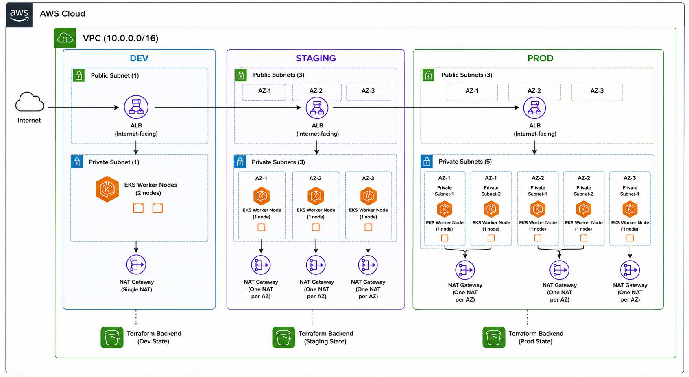

# TwentyCRM on AWS EKS — Terraform + GitHub Actions

Infrastructure-as-code project that provisions a multi-environment AWS platform (dev, staging, production) and deploys **TwentyCRM**, an open-source CRM, using Terraform, EKS, and a GitHub Actions CI/CD pipeline.

---

## 1. Why I chose this project

I picked TwentyCRM because it's a real open-source application with multiple moving parts — not just a static website — so deploying it gave me a realistic Terraform + Kubernetes project instead of a toy demo. It's a CRM, which software companies use to track their customers and sales deals. I chose it because self-hosted CRMs are a genuine alternative to paying for expensive SaaS tools like Salesforce, so it felt like a project with real-world relevance, not just a made-up example.

---

## 2. AWS architecture — and why I designed it this way



A single AWS VPC contains three isolated environments — **Development, Staging, and Production** — each with its own public and private subnets. An internet-facing **Application Load Balancer (ALB)** sits in the public subnets and routes traffic to an **Amazon EKS** cluster, whose worker nodes run in private subnets:


| Environment | Public subnets | Private subnets | EKS worker nodes | NAT strategy |
|---|---|---|---|---|
| Dev | 1 | 1 | 2 | Single NAT Gateway |
| Staging | 3 (one per AZ) | 3 (one per AZ) | 3 | One NAT Gateway per AZ |
| Production | 3 (one per AZ) | 5 | 5 | One NAT Gateway per AZ |

**Why this design:**
- **Public/private split** — only the ALB is internet-facing; EKS worker nodes and the app's Postgres/Redis have no direct route to the internet, following least-exposure principle.
- **Dev gets a single NAT Gateway** — dev doesn't need AZ-level fault tolerance for outbound traffic, so this is a straightforward cost saving.
- **Staging/Production get one NAT Gateway per AZ** — outbound internet access shouldn't have a single point of failure once it matters for reliability testing or real users.
- **IAM roles and policies are attached to the EKS cluster and managed node groups** (including IRSA for the AWS Load Balancer Controller) so workloads authenticate to AWS services with least-privilege, per-workload identity rather than broad node-level permissions.

---

## 3. How to use the Terraform and GitHub Actions pipeline

Each environment — dev, staging, production — has its own Terraform root module with its own S3 backend and state file:

```bash
cd environments/dev        # or staging / production
terraform init
terraform plan  -var-file=terraform.tfvars
terraform apply -var-file=terraform.tfvars
```

**CI/CD:** a GitHub Actions workflow triggers on every pull request and runs a matrix job across all three environments in parallel:

1. `terraform fmt -check` and `terraform validate`
2. `terraform plan`, with the output posted directly to the PR (GitHub Step Summary) for review
3. The plan is uploaded as a build artifact

It authenticates to AWS using **OIDC** (`role-to-assume`) — no static AWS keys are stored in GitHub.

---

## 4. Trade-offs I made

**1. Environment isolation — separate directories instead of Terraform Workspaces**
Decision: `dev/`, `staging/`, `prod/` as separate root modules, not Workspaces.
- ✅ Better isolation — each environment has its own backend config and state file; a mistake in Dev's state or backend can't touch Production.
- ✅ Easier to apply different variables, modules, and IAM permissions per environment.
- ❌ Slightly more code duplication than Workspaces would have.
- **Why I chose it:** I prioritized environment isolation and operational safety over reducing duplication.

**2. Separate Terraform state per environment**
Decision: a separate S3 backend bucket per environment.
- ✅ Production state is completely isolated from Dev.
- ✅ Reduced blast radius if a backend is ever misconfigured.
- ✅ Easier backup, recovery, and access control per environment.
- ❌ More backend resources to manage.

**3. Destroy protection**
Decision: environment isolation plus `prevent_destroy` on the state bucket lifecycle.
- ✅ Running `terraform destroy` in Dev can't cascade into Staging or Production.
- ❌ Each environment has to be destroyed separately — no single command tears everything down.


**4. Single combined GitHub Actions workflow (matrix), not path-based triggers**
Decision: one workflow runs a `dev`/`staging`/`production` matrix on every PR, rather than three workflows scoped to `dev/**`, `staging/**`, `prod/**` paths.
- ✅ Simple to reason about — one workflow file, one place to review CI logic.
- ✅ Every PR gets a plan for all three environments, so reviewers always see the full picture.
- ❌ Runs plans for environments that weren't actually touched by a given PR, which costs extra CI time/minutes as the project grows.
---

## 5. What I would change for real production

**CI/CD gating**
- Add a manual approval step before any Production apply, using GitHub protected environments, required reviewers, and branch protection — so no deployment reaches production without a human sign-off.
- Move to path-based triggers so each environment's pipeline only runs when that environment's code actually changes.

**Secrets management**
- Replace values currently in `values.yaml`/GitHub with **AWS Secrets Manager** or **SSM Parameter Store**, pulled into the cluster via the **External Secrets Operator** — so secrets are encrypted at rest, rotated, and never live in Git history.

**Disaster recovery**
- Cross-region S3 state replication.
- Automated backups.
- **Velero** for EKS backup and restore.

**Network isolation**
- Instead of one VPC hosting all three environments, I'd typically use one VPC per environment (or per AWS account), each spanning multiple AZs — stronger isolation, and a routing/security change in one environment can never affect another.

**Higher availability for EKS**
- Current node counts are static: Dev 2, Staging 3, Prod 5.
- I'd add **Cluster Autoscaler or Karpenter**, multiple managed node groups, **Pod Disruption Budgets**, and a **Horizontal Pod Autoscaler** so capacity actually responds to load instead of being fixed.

**Stateful services**
- Move Postgres and Redis (currently in-cluster via the Helm chart) onto **Amazon RDS** and **ElastiCache** — managed backups, automated failover, and point-in-time recovery instead of a pod holding customer data.

**Observability**
- Add monitoring/alerting (Prometheus/Grafana or Amazon Managed Prometheus, centralized logging) — this isn't set up yet and is the next thing I'd prioritize after DR and secrets.
